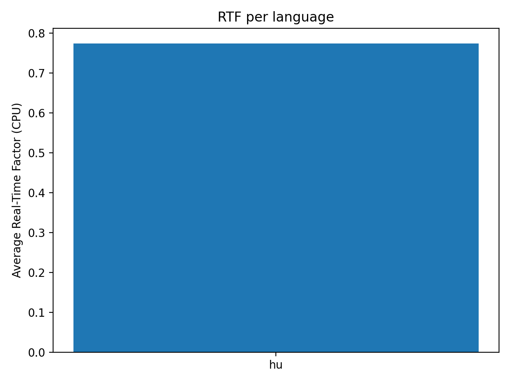

# CPU Evaluation Summary (Whisper-small)

## Aggregate WER/CER
| Lang | Mode | WER | CER | n |
|------|------|-----|-----|---|
| es | hinted | 0.172 | 0.049 | 20 |
| es | lid2asr | 0.189 | 0.055 | 10 |
| fr | hinted | 0.425 | 0.213 | 20 |
| fr | lid2asr | 0.410 | 0.205 | 10 |
| hu | hinted | 0.850 | 0.446 | 20 |
| hu | lid2asr | 0.807 | 0.444 | 6 |
| mn | hinted | 1.036 | 0.947 | 20 |
| mn | lid2asr | 1.026 | 0.976 | 6 |

**Interpretation:**  
- Spanish and French perform well (WER < 0.2 and < 0.5).  
- Hungarian and Mongolian remain difficult for Whisper-small on CPU.  
- LID→ASR slightly improves robustness for HU/MN but not substantially.

## Plots

